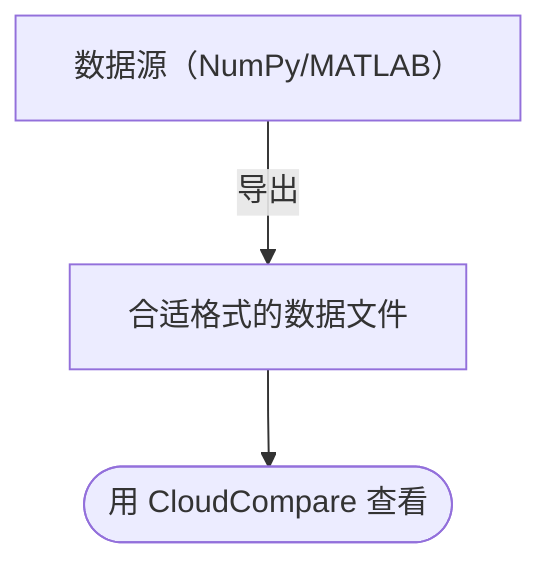

# CloudCompare 指南

[CloudCompare](https://www.cloudcompare.org/) 是一款点云处理软件，按 [GPL 2.0](https://www.gnu.org/licenses/old-licenses/gpl-2.0.en.html) 开[源](https://github.com/CloudCompare/CloudCompare)。

本指南将介绍以下流程。

